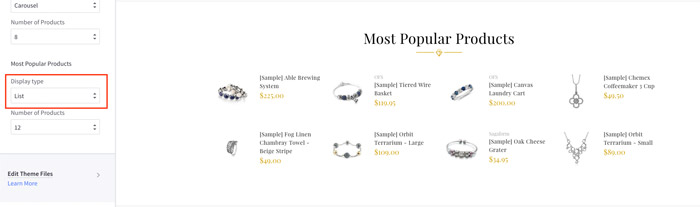
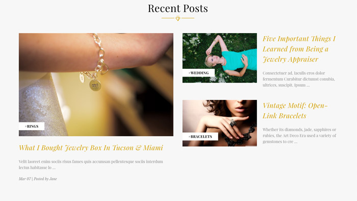

# Customization

This page will explain all configuration available and how to edit each section appear on theme. Let's view the first homepage.

## Top Banner

The top banner can be showed / edited in admin page > __Marketing__ > __Banners__. When you add / edit remember to choose __Location__ is __Top of Page__.

### Colors Customization

To customize colors of this section, go to admin page > __Storefront Design__ > __My Themes__, click button __Customize__ of the current theme to open the Theme Editor. 

Look into the options showing below:

## Header

### Header Styles
This theme support 2 different header styles:
- Logo at left
- Logo at right

To configure, open the __Theme Editor__, scroll down to section __Logo__, click to expand the logo options. Choose a certain option of __Logo position__, then click __Refresh__ button appear after.

### Colors Customization

To customize colors of the header section, look into the options showing below in the Theme Editor:

## Main Slideshow / Carousel

### Edit the slideshow

Edit the slideshow in admin page > __Storefront Design__ > __Design Options__:

### Colors Customization

To customize color of the slideshow's elements, look into section __Carousel__ in the Theme Editor:

### Hide the slideshow

To hide the slideshow on homepage, uncheck on the checkbox __Show Carousel__ in section __Carousel__ of the Theme Editor.

## New / Featured / Popular Products

The theme supports 4 layout type of __New Products__, __Featured Products__ and __Popular Products__ blocks:

__Grid__:

__Carousel__:

__List__:

### Configure a Layout Type of products block & Number of Products to show up

In the __Theme Editor__ > __Homepage__, look into __New Products__ section (or __Featured Products__, __Most Popular Products__):

- __Display type__: Choose appropriate layout type (__Grid__, __Carousel__, __List__).
- __Number of Products__: Choose number of products to show up.

### Show/Hide Quickview button

When hover on a product item, Quickview button is showed up by default. To disable this feature, uncheck the checkbox __Show Quickview__ in the __Theme Editor__ > __Products__ section.

### Change colors and image sizes

In the __Theme Editor__ > __Products__ section, Look into the color options below __Product cards__, __Product Sale Badges__, __Product cards (Quick search)__ and __Image sizes__'s options.

### Change the heading text

To change the heading text (New Products, Featured Products, Most Popular Products), edit the language file, look for the key `products` > `new` or `featured` or `top`.

## Image Banners

Theme supports many banner styles:

### 4 Banners Row

To edit these banners, edit the language file `en.json`, find keys `emthemesmodez` > `four_1`:

- `heading`: is section heading title.
- `banner1` to `banner4`:
    + `title`: is banner title.
    + `text`: is banner text content.
    + `button`: is action button.
    + `image`: is banner image.
    + `url`: is banner link.
 
 Theme supports display up to 3 instances of 4 banners.

### Parallax Banner

To edit these banners, edit the language file `en.json`, find keys `emthemesmodez` > `parallax_1`:

- `image`: is the parallax banner image.
- `shape`: is a fixed image in front of the parallax image.
- `url`: is the banner link.

Theme support display up to 3 parallax banners.

### 3 Banners Row

Support displaying up to  half-size banners on homepage.

To edit these banners, edit the language file `en.json`, find keys `emthemesmodez` > `banners` > `onethird_x3_1` to `onethird_x3_5` represent 5 fullwidth banners accordingly.

### 2/3 & 1/3 Banners

Support displaying up to 5 half-size banners on homepage.

To edit these banners, edit the language file `en.json`, find keys `emthemesmodez` > `banners` > `twothird_onethird_1` to `twothird_onethird_5` represent 5 fullwidth banners accordingly.

## Image Carousel

To edit image and links in this image carousel section, edit the language file, find key `emthemesmodez` > `image_carousel`

- `image*`: is link to the image.
- `title*`: is image text description.
- `url*`: is image link. Leave a single space letter in the value if you want to hide any image.

## Recent Blog Posts

This block show the most recent blog posts.

### Customize heading text and other text

To change the heading text, read more text and date format, edit the language file. Find the key `blog` > `recent_posts`, `posted_by` and `read_more`, edit its values as you want.

## Footer - Newsletter

### Change text

To change text appear on this section you can edit the language file as instruction below:

From admin page > __Storefront Design__ > __My Themes__, click button __Advanced__ > __Edit Theme Files__ of the current theme:

From the left navigation, click to edit the language file (e.i `en.json`):

See the section `Newsletter` you can edit as you want:

### Colors Customization

To customize colors of the header section, look into the options showing below in the __Theme Editor__ > __Footer__:

### Social Icons

To show/hide or change position of the Social Icons, look into the options showing below in the __Theme Editor__ > __Social Media Icons__:

## Footer - Custom Links, Contact Info

### Edit custom links

Edit the language file `en.json`, find keys `footer` > `links`:

- `col*_heading`: is column heading title.
- `col*_url*`: is link URL.
- `col*_title*`: is link text.

### Edit Contact Info text

Edit the language file, section `footer` > `call_us` and `email`:

The address is edited in admin page > __Store Setup__ > __Store Profile__ > __Store Address__:

## Footer - Payment Icons

To show/hide payment icons, go to Theme __Editor__ > __Payment Icons__ secitons, check or uncheck any icons you want to show or hide.

## Footer - Credit Links

To show/hide the credit links, go to Theme Editor > __Footer__ section, tick or untick the checkboxes as showing above.

## Edit footer template

If you want more control about the footer, you can edit the footer template at `templates` > `components` > `common` > `footer.html`:

