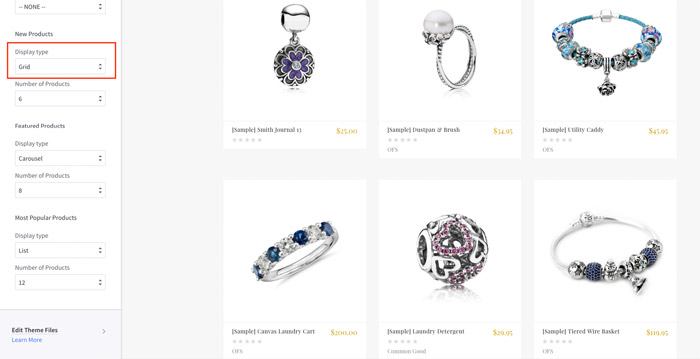
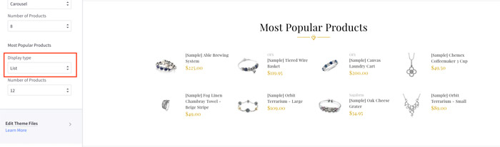
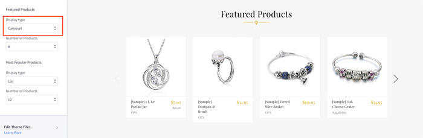
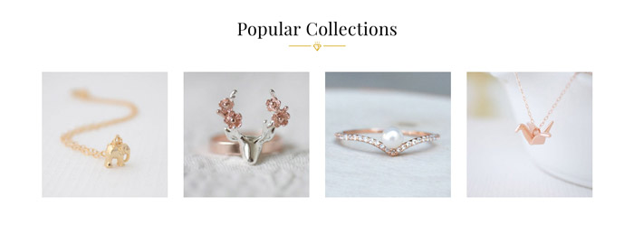
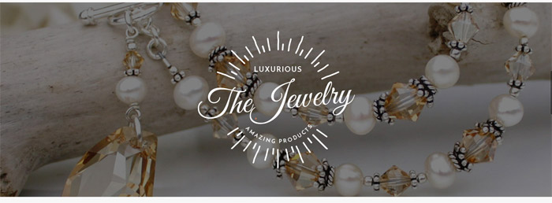
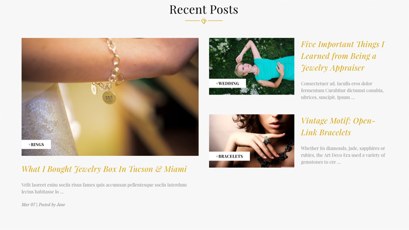

# Block Sections

This is a powerful and unique feature of the theme, let you rearrange contents, show/hide contents block on the homepages without editing the theme's source code. And __No HTML/CSS programming knowledge required__.

In the __Theme Editor__ > __Homepage__. There is 10 sections (or placeholder), where you can pick a content block to show on.

- __Section 1__ is a placeholder which only support __Carousel__ block - the main image slideshow.
- __Section 2__ to __Section 10__ are placeholder which support the following blocks:
	+ __New Products__
	+ __Featured Products__
	+ __Popular Products__
	+ __1st 3 Banners__
	+ __2nd 3 Banners__
	+ __3rd 3 Banners__
	+ __1st 4 Banners__
	+ __2nd 4 Banners__
	+ __3rd 4 Banners__
	+ __1st Two Banners 2/3 & 1/3 Column__
	+ __2nd Two Banners 2/3 & 1/3 Column__
	+ __3rd Two Banners 2/3 & 1/3 Column__
	+ __1st Parallax Banner__
	+ __2nd Parallax Banner__
	+ __3rd Parallax Banner__
	+ __Recent Blog Posts__
	+ __Brands Carousel__

## New / Featured / Popular Products Blocks

The theme supports 3 layout type of New Products, Featured Products and Popular Products blocks:

- Grid
- List
- Carousel

__Products Grid__:

__Products List__:

__Products Carousel__:

### Configure a Layout Type of products block & Number of Products to show up

In the __Theme Editor__ > __Homepage__, look into __New Products__ section (or __Featured Products__, __Most Popular Products__):

- __Display type__: Choose appropriate layout type (__Grid__, __List__ or __Carousel__).
- __Number of Products__: Choose number of products to show up.

### Show/Hide Quickview button

When hover on a product item, Quickview button is showed up by default. To disable this feature, uncheck the checkbox __Show Quickview__ in the __Theme Editor__ > __Products__ section.

### Change colors and image sizes

In the __Theme Editor__ > __Products__ section, Look into the color options below __Product cards__, __Product Sale Badges__, __Product cards (Quick search)__ and __Image sizes__'s options.

### Change the heading text

To change the heading text (New Products, Featured Products, Most Popular Products), edit the language file, look for the key `products` > `new` or `featured` or `top`.

## Image Banners

The theme supports these type of banner blocks:

- 2 Banners with size 2/3 column & 1/3 column.
- 3 Banners with the same size 1/3 column.
- 4 Banners with the same size 1/4 column.
- Parallax banners.

__Group of 2 banners size 2/3 & 1/3 column__

__Group of 3 banners same size 1/3 column__

__Group of 4 banners same size 1/4 column__

__Parallax banner__

Each banner type supports up to 3 instances.

### Edit banner text and images

To change banner images, heading text, description and buttons, edit the language file, find the key `emthemesmodez` > `banners`:

- `twothird_onethird_1`: The first group of 2 banners with size 2/3 column & 1/3 column
	+ `banner1`: Is the first banner
		* `title`: Banner heading text
		* `text`: Banner description text
		* `button`: Button text
		* `image`: Banner image URL
		* `url`: Image and button link
	+ `banner2`: Is the second banner
- `twothird_onethird_2`: The second group of 2 banners with size 2/3 column & 1/3 column
- `twothird_onethird_3`: The third group of 2 banners with size 2/3 column & 1/3 column
- `onethird_x3_1`: The first group of 3 banners with size 1/3 column
- `onethird_x3_2`: The first group of 3 banners with size 1/3 column
- `onethird_x3_3`: The first group of 3 banners with size 1/3 column

If you don't want to show any elements of a banner, for example the button, leave the value __a single space__ character. Example: `"button": " "`.

## Recent Blog Posts

This block show the most recent blog posts, maximum 3 posts are allowed to show up. 

### Customize heading text and other text

To change the heading text, read more text and date format, edit the language file. Find the key `blog` > `recent_posts`, `posted_by` and `read_more`, edit its values as you want.

